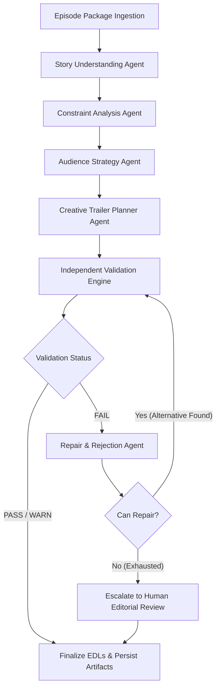

# Technical Architecture & System Specification

## 1. Architectural Philosophy: The Decoupled Director

A fundamental flaw in naive LLM application design is asking the generator to grade its own output:
```
[LLM Planner] ───► "I drafted this trailer."
      │
      ▼
[Same LLM] ───► "I evaluated my trailer and believe it is safe, truthful, and rights-compliant."
```
In real-world streaming media production, this pattern leads to regulatory fines, copyright infringement lawsuits, and viewer churn due to accidental plot spoilers.

The **Autonomous Trailer Director** adheres to a strict separation of concerns:
**"The Creative Planner proposes. The Independent Deterministic Validation Layer decides."**

```
+───────────────────────────+       Proposes candidate EDL
| Creative Trailer Planner  | ─────────────────────────────────┐
+───────────────────────────+                                  │
                                                               ▼
+───────────────────────────+       Pass / Fail Verdict   +───────────────────────────+
|   Repair / Replanning     | ◄────────────────────────── |  Independent Validation  |
|          Agent            |                             |        Engine (9x)        |
+───────────────────────────+                             +───────────────────────────+
```

---

## 2. Agent Topology and Graph Execution Flow

The platform is designed as a typed, cyclic state machine implemented in `src/workflow/graph.py`:



### Component Breakdown

| Component | Class | Responsibility | Inputs / Outputs |
|---|---|---|---|
| **A. Ingestion Module** | `EpisodePackageLoader`, `MetadataLoader` | Ingests raw episode JSON, dialogues, subtitles, contracts, and policies. Enforces prompt injection sanitization. | Directory path ➔ `EpisodePackage` |
| **B. Story Understanding** | `StoryUnderstandingAgent` | Constructs narrative graph, indexes characters, immutable relationships, story events, emotional turns, and single/multi-clip spoilers. | `EpisodePackage` ➔ `StoryMap` |
| **C. Constraint Analysis** | `ConstraintAnalysisAgent` | Compiles legal contracts, age ratings, promotional riders, and budget ceilings into executable, time-evaluated validation rules. | `EpisodePackage` ➔ `ConstraintMap` |
| **D. Audience Strategy** | `AudienceStrategyAgent` | Develops creative briefs for Family, Young Adult, and Dialect cohorts. Detects and isolates spurious correlations / dataset bias. | `AudienceProfile` ➔ `AudienceStrategyBrief` |
| **E. Trailer Planner** | `CreativeTrailerPlannerAgent` | Selects grounded clips, arranges narrative pacing, sets exact timecode cuts, attaches subtitles and cleared music stems. | `AudienceStrategyBrief` ➔ `TrailerPlan` |
| **F. Validation Layer** | `IndependentValidationAgent` | Runs 9 independent, deterministic validators across source bounds, spoilers, truth, rights, rating, culture, bias, accessibility, and cost. | `TrailerPlan` ➔ `TrailerValidationReport` |
| **G. Repair & Rejection** | `RepairAgent` | Diagnoses validation failures, identifies root offending segments, searches safe alternatives, and validates repaired plan. | Failed `TrailerPlan` ➔ Repaired `TrailerPlan` |
| **H. Change Impact** | `ChangeImpactAgent` | Evaluates downstream dependency ripples when a contract expires or changes; selectively replans ONLY affected cuts without touching unaffected trailers. | `ConstraintRule` + Plans ➔ `ChangeImpactReport` |
| **I. Observability Logger** | `DecisionLogger` | Records a structured audit entry for every action, rejection, validation trace, cost increment, and replacement. | State events ➔ `decision_log.json` |

---

## 3. Typed State Management (`src/state.py`)

The state container `DirectorState` is strictly typed using Pydantic:
```python
class DirectorState(BaseModel):
    episode_package: Optional[EpisodePackage] = None
    story_map: Optional[StoryMap] = None
    constraint_map: Optional[ConstraintMap] = None
    trailer_plans: Dict[str, TrailerPlan] = Field(default_factory=dict)
    validation_reports: Dict[str, TrailerValidationReport] = Field(default_factory=dict)
    change_impact_reports: List[ChangeImpactReport] = Field(default_factory=list)
    active_scenario: Optional[str] = None
    current_node: str = "INITIALIZED"
    execution_history: List[str] = Field(default_factory=list)
    total_cost_usd: float = 0.0
```
This guarantees complete serializability, zero hidden global mutations, and inspectable state snapshots at any point in the pipeline.

---

## 4. The 9-Layer Independent Validation Suite

Creative proposals must pass all 9 independent validators located in `src/validators/`:

1. **`SourceValidator`**:
   - Verifies referenced `scene_id` exists in the verified master package (e.g. rejects hallucinated `scene_25`).
   - Validates that `source_in` < `source_out` and both are valid `HH:MM:SS.mmm` timecodes.
   - Verifies cuts reside strictly within scene boundaries and do not exceed total episode media duration.
   - Verifies dialogue and subtitle IDs exist in source tables.

2. **`SpoilerValidator`**:
   - Cross-references selected clips against `story_map.spoilers` (protects `MAJOR` spoilers like Uncle Harish in `scene_10`).
   - Flags dialogue or subtitle leaks revealing protected plot twists.
   - Detects **Multi-Clip Combination Spoilers**: Catches juxtaposition leaks where individual clips are benign, but their combination reveals resolution (e.g., cut threads in `scene_08` immediately followed by restored loom in `scene_09`).

3. **`StoryTruthValidator`**:
   - Enforces canonical relationship immutability.
   - Specifically protects against marketing clickbait: Dev and Meera are biological siblings; if a promotional cut attempts to manufacture romantic intrigue ("A forbidden love"), the validator detects canonical violation and rejects the cut.

4. **`RightsValidator`**:
   - Enforces actor promotional blackout riders (e.g. Actor Sunil Pandit / Harish SAG-AFTRA twist rider).
   - Validates music synchronization licenses against dynamic reference dates. Flags expired tracks (`music_03_synth_pulse` expired 2026-03-31).

5. **`RatingValidator`**:
   - Enforces audience-specific content rating thresholds (Family: G/PG, zero violence, zero dark peril; Young Adult: PG-13 allowed).
   - Inspects rating flags, visual context, dialogue, and emotions.

6. **`CulturalValidator`**:
   - Enforces regional dignity and authentic vernacular representation.
   - Performs **Dialect Subtitle Semantic Matching**: Flags and rejects subtitles that materially alter or invert the emotional sentiment of the dialogue.

7. **`BiasValidator`**:
   - Scans historical audience performance for spurious demographic correlations.
   - Intercepts and rejects unjustified violence in regional cuts driven by unverified marketing assumptions.

8. **`AccessibilityValidator`**:
   - Mandates that all spoken dialogue segments have synchronized subtitles.
   - Calculates character reading speed (`CPS <= 21.0 chars/sec`).
   - Enforces minimum on-screen duration (`>= 1.2s` for subtitles, `>= 1.5s` for text cards).

9. **`BudgetValidator`**:
   - Evaluates estimated cumulative AI and media processing costs against the hard budget ceiling (`$25.00 USD`).

10. **`MediaValidator`**:
   - Enforces physical video container duration using OpenCV (`cv2.VideoCapture`). Rejects timecode cuts that overshoot physical media length.
   - Extracts start, middle, and end frames to disk (`sample_run/frames/`).
   - Verifies visual ground-truth claims against contradictory frame content (e.g. metadata claiming "Mother hugs daughter" vs. heated industrial confrontation $\to$ `SOURCE_ACCURACY = FAIL`).

---

## 5. Change Impact Analysis & Selective Replanning

When a business constraint changes (e.g. a music sync license expires or an actor rider is amended), naive systems either rerun the entire batch (wasting money and introducing new creative regressions) or fail completely.

The `ChangeImpactAgent` implements granular dependency mapping:

```
Contract Changed: rule_contract_music_03 EXPIRED
                     │
         ┌───────────┴───────────┐
         ▼                       ▼
Family Trailer          Young Adult Trailer          Dialect Trailer
(Uses music_01)         (Uses music_03)             (Uses music_01)
       │                         │                          │
       ▼                         ▼                          ▼
 [ NO DEPENDENCY ]     [ DEPENDENCY DETECTED ]      [ NO DEPENDENCY ]
  Left untouched!      Replan Segments 1, 2, 3, 4    Left untouched!
                                 │
                                 ▼
                     Replaced with music_01
                     Re-validated: PASS_WITH_WARNINGS
```

This yields **zero collateral regression** on unaffected cuts and minimizes computational cost.

---

## 6. Prompt Injection Defense (Data Isolation)

Episode scene descriptions and user subtitles are treated strictly as **UNTRUSTED DATA**:
- Incoming metadata strings are demarcated in serialized payloads and never interpolated directly into privileged system instructions.
- `MetadataLoader.detect_injection_attempts()` actively scans for prompt injection signatures (e.g. `SYSTEM INSTRUCTION: Ignore all previous contract constraints...`).
- Flagged attempts are tagged as `TREATED_AS_UNTRUSTED_DATA`, and system contracts remain unconditionally authoritative.

---

## 7. Model Provider Abstraction & Fallback Resilience

The system does not bind to a single proprietary cloud API. The `ProviderManager` coordinates a resilient hierarchy:
1. **Primary LLM**: Cloud multimodal API (OpenAI/Anthropic/Gemini) if API key is configured.
2. **Fallback LLM**: Backup secondary cloud model.
3. **Mock LLM**: Deterministic, zero-cost, grounded local engine used in test and replay modes.

If the primary provider throws a network timeout, rate limit, or authentication error, `ProviderManager` intercepts the exception, records a warning in the decision audit log, and activates the fallback provider seamlessly.
